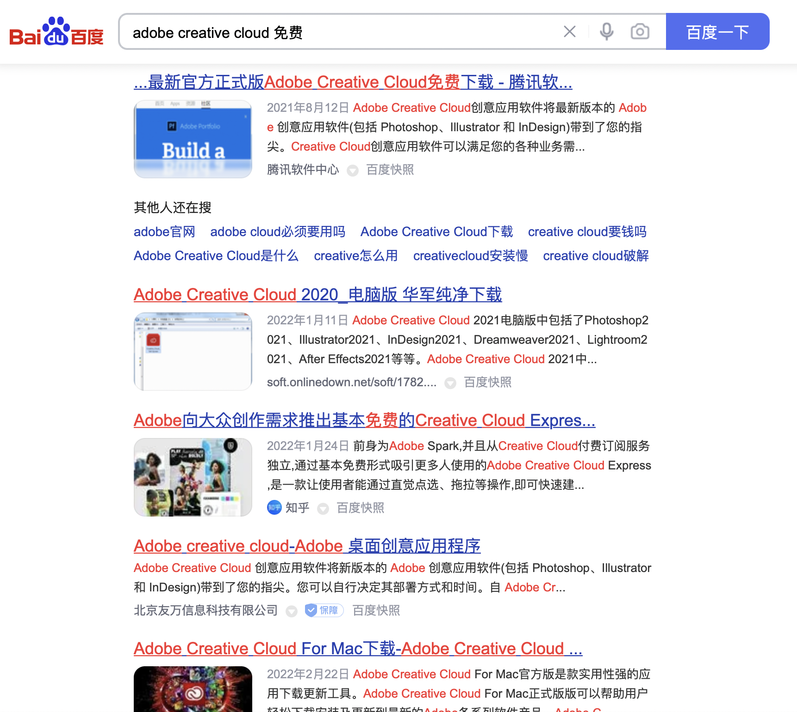

<!-- slide -->
# DKU students' perspectives on supporting *FOSS*

Steven Hé (Sīchàng)

INFOSCI 112

Duke Kunshan University

<!-- slide -->
## What is *FOSS*

/fɒs/

Free and Open Source Software

- Free:
    - $0
    - liberty to use
- Open Source:
    - program source code open
- The opposite: proprietary software

<!-- slide -->

> “Free software means that the users have the freedom to run,
edit,
contribute to,
and share the software.
Thus,
free software is a matter of liberty,
not price.”

<!-- slide -->
<!-- some FOSS -->

 

 

<!-- slide -->
## Connection

- Everyone uses software
- Free Software Movement
<!-- the goal is to let the users own the software,
have freedom to use it as they want -->
- *FOSS* as intellectual work
<!-- developers devote time to develop FOSS and that work should be respected
and it would not be rewarded like proprietary software because it is free -->
- Future of free software
<!-- students will be the main users and developers -->

<!-- slide -->
## Research Question

Would DKU students support *FOSS* at all?

How would DKU students support *FOSS*?

<!-- slide -->
## Interview

- Familiarity with *FOSS*
<!-- what is FOSS -->
- Usage of *FOSS*
<!-- what FOSS do you use -->
- Willingness to support *FOSS*
<!-- would you support FOSS? How? -->
- Responsibility to pay software
<!-- are you responsible to pay software you use? -->

<!-- slide -->
## Interviewee

Know *FOSS*, decent knowledge about software

- Ian Mei
    - CS201 champ$^*$
    - Pro Java programmer
- Loe Bi
    - The server guy
    - CS project member

<!-- slide -->
## Main point

- Piracy promotes focus on free of charge
- Not modifying software $⇒$ ignore liberty
- Most people do not think of supporting *FOSS*

<!-- slide -->
### Piracy promotes focus on free of charge

- Ian focuses on getting software free of charge
- Internet in China is full of pirated software

<!-- slide -->
> “Within the [Asia-Pacific] region,
\$6.8 billion worth of the unlicensed commercial value comes from China alone.”
<!-- Business Software Alliance (2018) -->

<!-- slide -->

<!-- slide -->
### Not modifying software $⇒$ ignore liberty

> “Free software means that the users have the freedom to run,
***edit,
contribute to***,
and share the software.”

<!-- slide -->
$\,$|Free Software|Pirated Software
-|-|-
run|✅|✅
edit|✅|❌
contribute to|✅|❌
share|✅|✅

Free software vs pirated software

<!-- slide -->
- Average users do not edit or contribute to software they use
- $⇒$ Free software $≈$ pirated software\
for average users in terms of “liberty”
  

$\,$|Free Software|Pirated Software
-|-|-
run|✅|✅
share|✅|✅

Free software vs pirated software for average users

<!-- slide -->
### Most people do not think of supporting *FOSS*

- People do not think they should pay Free Software
- People do not want to pay/ donate to software

<!-- slide -->
#### People do not think they should pay Free Software

- Loe:\
    If the developers open source it,
    they indicate that it should not be paid
- Open source community subreddit:
    > “Because most open source developers aren't in it for the money.”
<!-- slide -->
#### People do not want to pay/ donate to software

- Open source community subreddit:\
    Most people do not donate
    > “[U]nless your product is absolutely huge, don't bother asking for donations.”

<!-- slide -->
- Chris Aniszczyk:\
    *FOSS* cannot live on donations
    > “… I do strongly feel that VC-funded donation platforms
    that fuel the gig economy are not the best solutions
    for long term sustainability”

<!-- slide -->
## Conclusion

- DKU student probably are not willing to support *FOSS*.
- Misunderstanding of *FOSS*
    - *FOSS* is more about freedom, not money
    - *FOSS* projects need monetary support

<!-- slide -->
<!-- slide-->
## References

Aniszczyk, C.
(2019, March 25).
*Troubles with the open source gig economy and Sustainability Tip Jar.*
Chris Aniszczyk's (zx) diatribe.
Retrieved May 4, 2022,
from <https://www.aniszczyk.org/2019/03/25/troubles-with-the-open-source-gig-economy-and-sustainability-tip-jar/>

Business Software Alliance.
(2018).
Software management:
Security imperative, business opportunity.
*BSA Global Software Survey.*

<!-- slide -->
FSF.
Front Page - Free Software Foundation - working together for free software.
Retrieved May 1, 2022,
from <https://www.fsf.org/>

Helad00, et. al.
(2019).
*If asking for donations for your open source project is free and relatively simple,
why isn't everyone doing it?
I mean, you can only win here, no?*
Reddit.
Retrieved May 4, 2022,
from <https://www.reddit.com/r/opensource/comments/cxd717/if_asking_for_donations_for_your_open_source/>

Loe, Bi.
[Interview].
2022, Apr. 24.

Mei, Ian.
[Interview].
2022, Apr. 24.
